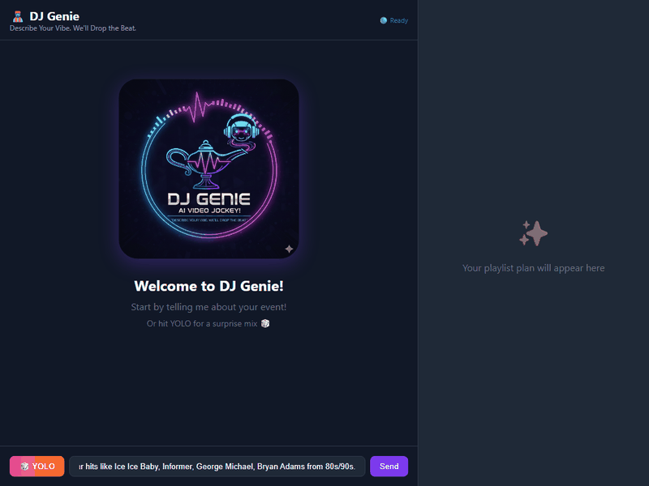

<p align="center">
  
</p>

# 🧞‍♂️ DJ Genie - Your AI Video Jockey!

> **"Describe Your Vibe. We'll Drop the Beat."**

An intelligent AI-powered YouTube video mixing application that creates professional DJ-style party mixes. DJ Genie combines advanced audio signal processing, crowd-sourced engagement data, and large language models to extract the perfect segments, create seamless transitions, and generate authentic culture-aware DJ commentary—just like a real party DJ.


---

## 🧠 The Intelligence Behind DJ Genie

What makes DJ Genie special isn't just that it mixes videos—it's **how intelligently** it does it:

### 🎯 Hybrid Segment Intelligence: Heatmaps + Audio Analysis

Finding the *right* part of a song is crucial. DJ Genie uses a **two-signal hybrid approach**:

#### 1️⃣ YouTube "Most Replayed" Heatmaps
YouTube tracks which parts of videos viewers replay most—a powerful signal for what's catchy and memorable. DJ Genie:
- **Extracts heatmap data** from YouTube's viewer engagement metrics
- **Identifies peak replay zones** where viewers keep coming back
- **Focuses on the first 3 minutes** where hooks and choruses typically live
- Uses a **sliding window algorithm** to find the segment with highest average replay intensity

#### 2️⃣ Librosa Audio Energy Analysis  
Real-time audio analysis using signal processing:
- **RMS Energy (Volume Envelope)** - How loud is each part?
- **Spectral Centroid (Brightness)** - How exciting/bright is the sound?
- **Onset Strength (Punch)** - How rhythmic and punchy are the beats?

These three signals are weighted (40% RMS, 30% spectral, 30% onset) and combined into a **composite energy curve** that reveals the song's high-energy peaks.

#### 🔀 The Hybrid Decision
```
If heatmap_energy > 50% of max_audio_energy OR heatmap_popularity > 0.7:
    → Use YouTube's crowd-sourced wisdom (what viewers love)
Else:
    → Use audio analysis peak (loudest/most energetic part)
```

### 🥁 Beat-Aligned Cuts: Never Cut Mid-Lyric

DJ Genie uses **beat tracking** and **phrase boundary detection** to ensure cuts sound natural:

1. **Beat Detection** - Librosa identifies all beats in the song
2. **Phrase Boundary Detection** - Analyzes RMS energy to find natural pauses
3. **Snap-to-Beat Algorithm**:
   - Start time → snaps to nearest beat **after** (let the phrase begin)
   - End time → snaps to nearest beat **before** (let the phrase finish)

This prevents jarring mid-word cuts that make amateur mixes sound choppy.

### ⚡ Energy-Aware Dynamic Segment Duration

Not all songs deserve equal time. DJ Genie dynamically adjusts:

| Energy Level | Segment Duration | Why? |
|--------------|------------------|------|
| High (>80%) | 45-55 seconds | Keep it punchy! High energy doesn't need to linger |
| Medium (50-80%) | 55-70 seconds | Balanced exposure |
| Lower (<50%) | 70-90 seconds | Atmospheric tracks need time to breathe |

### 🎚️ Intelligent Mix Ordering

Songs aren't just shuffled—they're **orchestrated for energy flow**:

1. **BPM Matching** - Minimize tempo jumps between adjacent songs using nearest-neighbor algorithm
2. **Harmonic Relationships** - Detects half-time/double-time matches (80 BPM → 160 BPM feels natural)
3. **Energy Curve Shaping** - Builds a "peak middle" party curve:
   - Start: Medium energy (get people moving)
   - Middle: Peak energy (party climax!)  
   - End: Cool down (graceful exit)
4. **Language Variety** - Prevents more than 2 consecutive same-language tracks

---

## 🎙️ AI DJ: Culture-Aware, Lifelike Commentary

DJ Genie's voice isn't generic robotic announcements—it's a **culturally intelligent DJ persona** powered by Azure OpenAI GPT-4.

### 🌍 Culture-Specific Knowledge

The AI understands cultural context for each language, for example:

| Language | Cultural Vibe | Notable Artists/References |
|----------|---------------|---------------------------|
| **Hindi** | Bollywood magic | Arijit Singh, Shreya Ghoshal, SRK movies |
| **Tamil** | Kollywood beats | Rajinikanth, Vijay, AR Rahman |
| **Malayalam** | Mollywood melodies | Mohanlal, Mammootty, Dulquer |
| **Turkish** | Turkish pop vibes | Tarkan, Sezen Aksu |
| **Arabic** | Middle Eastern grooves | Amr Diab, Nancy Ajram |
| **Uzbek** | Central Asian rhythms | Uzbek folk fusion |

### 🎤 Smart DJ Commentary Types

The AI generates 5 distinct types of commentary, distributed based on playlist length:

| Type | Purpose | Timing | Length |
|------|---------|--------|--------|
| **intro** | Theme-based party opener | 1.5s into video | 8-12 words |
| **next_up** | Quick song/artist callout | Before song starts | 5-8 words |
| **shoutout** | Personal callout to party people | Mid-song (50%) | 5-10 words |
| **cultural** | Language-appropriate slang | Early-mid song (30%) | 2-4 words only! |
| **outro** | Theme-based closing | Last 12 seconds | 8-12 words |

**Examples:**
- **intro**: "Happy New Year everyone! 2026 here we come, let's party!"
- **next_up**: "Next up, MJ!" / "Here comes AR Rahman!"
- **shoutout**: "Karim, break a leg!" / "Muskaan, you're on fire!"
- **cultural**: "Adipoli!" (Malayalam) / "Mass!" (Tamil) / "Paaji rocks!" (Punjabi)
- **outro**: "What a night! Happy 2026 everyone, stay blessed!"

### 🌍 Culture-Specific Phrases

The AI uses culturally appropriate slang for each language:

| Language | Cultural Phrases |
|----------|-----------------|
| **Hindi** | "Arey waah!", "Jhakaas!", "Ekdum mast!" |
| **Tamil** | "Mass!", "Theri!", "Vera level!", "Thalaivar!" |
| **Malayalam** | "Adipoli!", "Pwoli!", "Kidu!" |
| **Punjabi** | "Balle balle!", "Oye hoye!", "Paaji rocks!" |
| **Arabic** | "Yalla habibi!", "Khalas!" |
| **Turkish** | "Harika!", "Süper!" |
| **English** | "Let's go!", "Fire!", "Vibes!" |

### 🎵 Intelligent Comment Distribution

Comments are distributed proportionally based on playlist length:
- **~40%** of songs get a "next up" callout
- **~30%** of songs get a personal shoutout (spread across different people)
- **~30%** of songs get a cultural phrase
- Plus intro and outro for every mix

For a 10-song mix, you'll hear approximately **12 DJ comments** spread throughout!

### 🔊 Professional Audio Mixing

DJ commentary sits perfectly in the mix:
- **Music ducking**: Background music drops to 20% during DJ voice
- **Voice boost**: DJ clips amplified 3x for clarity
- **Crossfade buffer**: 0.3s fade-in/out on ducking for smoothness
- **Overlap prevention**: Minimum 3-second gap between comments

---

## ⚠️ Legal Disclaimer

**IMPORTANT: This project is for educational and demonstration purposes only.**

This application is designed to showcase what's possible with modern AI technologies, including:
- Large Language Models (GPT-4)
- Text-to-Speech synthesis (Azure OpenAI)
- Audio signal processing and beat detection
- Video processing and transitions

**This code is NOT intended for:**
- Downloading copyrighted content without permission
- Creating commercial products from copyrighted material
- Circumventing any DRM or content protection
- Any form of piracy or copyright infringement

**By using this software, you agree to:**
- Only use it with content you have rights to use
- Comply with all applicable copyright laws in your jurisdiction
- Take full responsibility for how you use this tool
- Not hold the authors liable for any misuse

**The authors do not condone piracy or copyright infringement of any kind.**

---

## ✨ Features at a Glance

### 🧞‍♂️ Natural Language Playlist Creation
Just describe your party:
> "Create a 10-song New Year's Eve party mix with Bollywood hits, 80s classics, and EDM. High energy. Shoutouts to Sarah and Mike!"

The AI understands themes, moods, languages, and cultural preferences.

### 🎬 Cinematic Video Transitions
- **Fade** - Classic smooth fade between clips
- **Dissolve** - Cinematic dissolve effect
- **Fade to Black** - Professional DJ-style transition
- **Circle Crop** - Dynamic circular reveal
- **Radial Wipe** - Energetic radial transition
- **Wipe Effects** - Left, right, smooth variations

### 🎵 Professional Audio Engineering
- **3.5-second crossfades** for seamless song blending
- **Beat-synchronized cuts** that respect musical phrases
- **Adaptive music ducking** during DJ commentary
- **A/V sync preservation** throughout the mix

### 🌍 Multi-Language Intelligence
Understands and mixes songs across:
- English, Hindi, Tamil, Malayalam
- Arabic, Turkish, Uzbek
- And more!

---

## 🔬 Technical Deep Dive

### Audio Analysis Pipeline

```
┌──────────────────────────────────────────────────────────────────┐
│                    AUDIO ANALYSIS PIPELINE                        │
├──────────────────────────────────────────────────────────────────┤
│                                                                   │
│  ┌─────────────┐    ┌──────────────────┐    ┌─────────────────┐  │
│  │  YouTube    │    │   librosa        │    │   Hybrid        │  │
│  │  Heatmap    │───▶│   Energy Curve   │───▶│   Decision      │  │
│  │  (Viewers)  │    │   (Audio Signal) │    │   Engine        │  │
│  └─────────────┘    └──────────────────┘    └────────┬────────┘  │
│                                                       │           │
│  ┌────────────────────────────────────────────────────▼────────┐ │
│  │                    BEAT ALIGNMENT                            │ │
│  │  ┌──────────┐   ┌──────────────┐   ┌───────────────────┐    │ │
│  │  │  Beat    │   │  Phrase      │   │  Snap-to-Beat     │    │ │
│  │  │  Track   │──▶│  Boundary    │──▶│  Refinement       │    │ │
│  │  │  (tempo) │   │  Detection   │   │  (start/end)      │    │ │
│  │  └──────────┘   └──────────────┘   └───────────────────┘    │ │
│  └──────────────────────────────────────────────────────────────┘ │
│                                                                   │
│  OUTPUT: Beat-aligned segment with optimal start/end times        │
└──────────────────────────────────────────────────────────────────┘
```

### Energy Curve Calculation

```python
# Weighted combination of audio features
energy = (
    0.4 × RMS_normalized +      # Volume envelope (40%)
    0.3 × Spectral_centroid +   # Brightness (30%)
    0.3 × Onset_strength        # Rhythmic punch (30%)
)
# Smoothed with moving average kernel to reduce noise
```

### Intelligent Mix Ordering Algorithm

```
┌─────────────────────────────────────────────────────────────┐
│                  MIX ORDERING STRATEGY                       │
├─────────────────────────────────────────────────────────────┤
│                                                              │
│   INPUT: Unordered songs with BPM + Energy scores            │
│                                                              │
│   Step 1: Sort by energy                                     │
│   Step 2: Apply "Peak Middle" curve                          │
│           ┌─────────────────────────────────────┐            │
│           │     ████████████                    │            │
│           │   ██            ██                  │  ← Energy  │
│           │ ██                ████              │            │
│           │█                      ████████      │            │
│           └─────────────────────────────────────┘            │
│            Start    Build-up    Peak    Cool-down            │
│                                                              │
│   Step 3: Minimize BPM jumps (nearest-neighbor)              │
│   Step 4: Ensure language variety (max 2 consecutive)        │
│                                                              │
│   OUTPUT: Optimally ordered playlist                         │
└─────────────────────────────────────────────────────────────┘
```

---

## 🚀 Quick Start

### Prerequisites
- **Python 3.9+**
- **Node.js 18+**
- **FFmpeg** (with ffprobe)
- **Azure OpenAI** access (for AI features)

### Installation

1. **Clone the repository**
   ```bash
   git clone https://github.com/meetshamir/video-dj-playlist.git
   cd video-dj-playlist
   ```

2. **Set up Python environment**
   ```bash
   python -m venv .venv
   .venv\Scripts\Activate.ps1  # Windows
   # or: source .venv/bin/activate  # Linux/Mac
   
   pip install -r backend/requirements.txt
   ```

3. **Set up Frontend**
   ```bash
   cd frontend
   npm install
   ```

4. **Configure Azure OpenAI** (for AI features)
   
   Set environment variables:
   ```bash
   AZURE_OPENAI_ENDPOINT=https://your-resource.openai.azure.com/
   AZURE_OPENAI_DEPLOYMENT=gpt-4
   AZURE_OPENAI_API_VERSION=2024-02-15-preview
   ```

5. **Start the servers**
   ```bash
   # Terminal 1 - Backend
   cd backend
   python -m uvicorn main:app --host 127.0.0.1 --port 9876
   
   # Terminal 2 - Frontend
   cd frontend
   npm run dev
   ```

6. **Open the app**
   Navigate to `http://localhost:5173`

---

## 🎮 How to Use

### Using DJ Genie

1. Open the app at `http://localhost:5173`
2. Describe your party in natural language
3. Have a conversation with the AI to refine your mix
4. Review the AI's suggested playlist
5. Click **"Approve & Generate 🎧"**
6. Wait for the magic to happen!
7. Download your professional DJ mix

### 💬 Example Conversation

Here's a real conversation with DJ Genie creating a New Year's Eve party mix:



---

**You:** Create a 10 min max video. Songs should be 30-60 seconds each. Theme: New Year Party - Goodbye 2025, Welcome 2026! Shoutouts to: Karim, Doni, Halima, Ayesha, Anisha, Remin, Muskaan, SMAT, Daisy, Mehr, Shamir. Include: Hit dance songs from last 3 years (Hindi, Tamil, Malayalam, Arabic, Turkish, Uzbek, English), SRK songs across the years, Tamil kuttu songs like Apdi Podu, MJ hits, recent English hits including Industry Baby, Badshah, Honey Singh, Anu Malik numbers, AR Rahman songs (Tamil & Hindi), Youm Wara Youm, and yesteryear hits like Ice Ice Baby, Informer, George Michael, Bryan Adams from 80s/90s.

---

**🧞‍♂️ DJ Genie:** Wow, what a spectacular lineup you've got planned for your New Year's bash! 🎉 Let's make sure we cover all the amazing vibes you want to bring in as we say goodbye to 2025 and welcome 2026 with a bang. Here's how we'll get this party started:

- **Theme:** New Year Party - Goodbye 2025, Welcome 2026!
- **Mood:** Energetic, Celebratory, Nostalgic
- **Duration:** 10 minutes
- **Language Preferences:** Hindi, Tamil, Malayalam, Arabic, Turkish, Uzbek, English

Let's dive into the playlist and make sure it's as vibrant as your guest list! 🥳

```json
{
  "ready": true,
  "theme": "New Year Party - Goodbye 2025, Welcome 2026!",
  "mood": ["energetic", "celebratory", "nostalgic"],
  "languages": ["Hindi", "Tamil", "Malayalam", "Arabic", "Turkish", "Uzbek", "English"],
  "duration_minutes": 10,
  "songs": [
    {
      "title": "Industry Baby",
      "artist": "Lil Nas X, Jack Harlow",
      "language": "English",
      "why": "Recent hit to start the energy high!"
    },
    {
      "title": "Apdi Podu",
      "artist": "Vijay, Deva",
      "language": "Tamil",
      "why": "Classic Kuttu song to amp up the dance floor!"
    },
    {
      "title": "Jhoome Jo Pathaan",
      "artist": "Vishal-Shekhar, Arijit Singh",
      "language": "Hindi",
      "why": "Super hit SRK number to get everyone grooving!"
    },
    {
      "title": "Youm Wara Youm",
      "artist": "Samira Said",
      "language": "Arabic",
      "why": "Arabic vibe to add an exotic touch!"
    },
    {
      "title": "Ice Ice Baby",
      "artist": "Vanilla Ice",
      "language": "English",
      "why": "Nostalgic hit from the 90s to bring back memories!"
    },
    {
      "title": "Calm Down",
      "artist": "Rema, Selena Gomez",
      "language": "English",
      "why": "Recent chartbuster to keep the mood lively!"
    },
    {
      "title": "Bole Chudiyan",
      "artist": "Karan Johar",
      "language": "Hindi",
      "why": "Bollywood classic to evoke some nostalgia!"
    },
    {
      "title": "Alla Yarim",
      "artist": "Zarina Nizomiddinova",
      "language": "Uzbek",
      "why": "Catchy Uzbek track for a cultural twist!"
    }
  ],
  "party_people": ["Karim", "Doni", "Halima", "Ayesha", "Anisha", "Remin", "Muskaan", "SMAT", "Daisy", "Mehr", "Shamir"],
  "cultural_phrases": {
    "hindi": ["Arey waah!", "Jhakaas!", "Mast hai!"],
    "tamil": ["Mass!", "Theri!", "Vera level!"],
    "malayalam": ["Adipoli!", "Pwoli!", "Kidu!"],
    "arabic": ["Yalla habibi!", "Khalas!"],
    "turkish": ["Harika!", "Süper!"],
    "uzbek": ["Zo'r!", "Ajoyib!"],
    "english": ["Let's go!", "Fire!", "Vibes!"]
  },
  "commentary_samples": ["Welcome!", "Are you ready to rock 2026?! 🌟"],
  "shoutouts": ["Happy New Year!", "Let's make some noise for Karim, Doni, Halima, Ayesha, Anisha, Remin, Muskaan, SMAT, Daisy, Mehr, and Shamir! 🎉"]
}
```

This diverse and energetic setlist is sure to keep your party people on their feet! Time to dance the night away and welcome 2026 with open arms! 🎊 Let's get this party started! 💃🕺

---

**✅ Your mix is ready!**

📋 **Mix Timeline:**

⏱️ 0:03 - 🎬 "What's up party people! Welcome to the New Year Party - Goodbye 2025, Welcome 2026!! Let's get this celebration started!"
⏱️ 0:04 - 🎵 **Apdi Podu** by Vijay, Deva
⏱️ 0:45 - 🎵 **Bole Chudiyan** by Karan Johar
⏱️ 1:26 - 🎵 **Industry Baby** by Lil Nas X, Jack Harlow
⏱️ 2:06 - 🎵 **Calm Down** by Rema, Selena Gomez
⏱️ 2:43 - 🗣️ "We're halfway through this amazing mix! Uzbek vibes coming in hot!"
⏱️ 2:48 - 🎵 **Alla Yarim** by Zarina Nizomiddinova
⏱️ 3:29 - 🎵 **Jhoome Jo Pathaan** by Vishal-Shekhar, Arijit Singh
⏱️ 4:10 - 🎵 **Youm Wara Youm** by Samira Said
⏱️ 4:51 - 🎵 **Ice Ice Baby** by Vanilla Ice
⏱️ 5:20 - 🎤 "That's a wrap on this incredible party! New Year Party - Goodbye 2025, Welcome 2026! - what a night! Stay groovy!"

⬇️ Download your mix from the panel on the right!

---

The AI generates a complete video mix with all your requested songs, smooth transitions, and culture-aware DJ commentary calling out your friends by name!

---

## 🛠️ Tech Stack

| Component | Technology | Purpose |
|-----------|------------|---------|
| **Backend** | Python, FastAPI, SQLite | API server and data persistence |
| **Frontend** | React 18, TypeScript, Vite | Modern reactive UI |
| **AI/LLM** | Azure OpenAI GPT-4 | Playlist generation, DJ commentary |
| **Text-to-Speech** | Azure OpenAI TTS (gpt-4o-mini-tts) | Lifelike DJ voice synthesis |
| **Audio Analysis** | librosa, numpy, scipy | Beat detection, energy analysis, phrase boundaries |
| **Video Processing** | FFmpeg | Transitions, crossfades, overlays |
| **Video Download** | yt-dlp | YouTube video/heatmap extraction |

### Key Libraries

| Library | Role in DJ Genie |
|---------|------------------|
| **librosa** | BPM detection, beat tracking, RMS energy, spectral analysis |
| **scipy** | Peak detection for phrase boundary finding |
| **numpy** | Signal processing, sliding window algorithms |
| **yt-dlp** | Video download + extraction of "Most Replayed" heatmap data |
| **FFmpeg** | Video transitions (xfade), audio ducking, crossfades |

---

## 🎛️ Configuration

### DJ Voice Settings

| Setting | Options |
|---------|---------|
| Voice Style | `energetic_male`, `smooth_female`, `hype_dj` |
| Frequency | `minimal`, `moderate`, `frequent` |
| Music Duck Level | 20% (during commentary) |
| Voice Boost | 3.0x amplification |

### Segment Analysis Settings

| Setting | Default | Description |
|---------|---------|-------------|
| Min Segment Duration | 45 seconds | Shortest allowed segment |
| Max Segment Duration | 90 seconds | Longest allowed segment |
| Analysis Window | First 3 minutes | Focus area for heatmap + energy analysis |
| Beat Snap Range | ±5 seconds | How far to search for beat boundaries |

### Transition Settings

| Setting | Default |
|---------|---------|
| Crossfade Duration | 3.5 seconds |
| Audio Crossfade | Enabled |
| Visual Effect | Random (fade, dissolve, etc.) |

### Video Quality

| Quality | Resolution |
|---------|------------|
| 480p | 854 × 480 |
| 720p | 1280 × 720 (default) |
| 1080p | 1920 × 1080 |

---

## 📁 Project Structure

```
dj-genie/
├── backend/
│   ├── api/
│   │   └── routes.py              # REST API endpoints
│   ├── services/
│   │   ├── analysis.py            # 🎯 Audio energy & beat detection (librosa)
│   │   ├── auto_playlist.py       # 🧠 Hybrid segment selection (heatmap + energy)
│   │   ├── azure_dj_voice.py      # 🎙️ GPT-4 DJ commentary + TTS
│   │   ├── exporter.py            # 🎬 Video transitions & mixing
│   │   ├── mixer.py               # 🎚️ Intelligent mix ordering (BPM/energy)
│   │   ├── song_recommender.py    # 🎵 AI playlist planning
│   │   └── downloader.py          # ⬇️ YouTube video + heatmap extraction
│   ├── main.py                    # FastAPI application
│   └── requirements.txt
├── frontend/
│   ├── src/
│   │   ├── pages/
│   │   │   └── AIPlaylistPage.tsx # DJ Genie chat interface
│   │   └── api.ts                 # Backend API client
│   └── package.json
├── exports/                       # Generated video mixes
├── cache/                         # Downloaded videos & analysis cache
└── README.md
```

### Service Responsibilities

| Service | Intelligence |
|---------|-------------|
| **analysis.py** | Calculates composite energy curves, detects BPM, finds beat times |
| **auto_playlist.py** | Hybrid heatmap+energy segment selection, beat-aligned cuts |
| **azure_dj_voice.py** | Culture-aware GPT commentary, intelligent comment placement |
| **mixer.py** | BPM-smooth ordering, energy curve shaping, language variety |
| **exporter.py** | FFmpeg orchestration, crossfades, music ducking |

---

## 🔧 Troubleshooting

### "Video won't play" or playback issues
- **Use VLC Media Player** - Windows Media Player and some browsers have codec issues. VLC handles all video formats reliably: https://www.videolan.org/vlc/
- Ensure FFmpeg is installed and in PATH
- Check that all source videos downloaded successfully
- Look for A/V sync warnings in the console

### "DJ voice not audible"
- Verify Azure OpenAI credentials are set
- Check that TTS generation succeeded in logs
- Music ducking should reduce music to 20% during commentary

### "Transitions not visible"
- Ensure `create_transition_concat` is being used (not `simple_concat`)
- Transition duration is 3.5 seconds
- Check FFmpeg supports the xfade filter

### "Download failed"
- YouTube may require authentication cookies (see below)
- Check for rate limiting (wait a few minutes and try again)
- Ensure yt-dlp is up to date: `pip install -U yt-dlp`

---

## 🍪 YouTube Authentication (Cookies)

YouTube sometimes requires authentication to access videos. If downloads fail, you'll need to export your browser cookies:

### Option 1: Automatic (Windows + Edge)
```bash
# Close Edge completely first (check system tray!)
.\export_youtube_cookies.bat
```

### Option 2: Python Script
```bash
python export_cookies.py
```

### Option 3: Manual Export
1. Install browser extension: **"Get cookies.txt LOCALLY"** ([Chrome](https://chrome.google.com/webstore/detail/get-cookiestxt-locally/cclelndahbckbenkjhflpdbgdldlbecc))
2. Go to https://www.youtube.com and ensure you're logged in
3. Click the extension → Export
4. Save to `cache/youtube_cookies.txt`

**Note:** Cookies expire periodically. Re-export if downloads start failing again.

---

## 🙏 Acknowledgments

- **Azure OpenAI** for GPT-4 and TTS capabilities that power culture-aware DJ commentary
- **librosa** - The backbone of our audio intelligence (BPM, beats, energy analysis)
- **FFmpeg** - Rock-solid video processing and transitions
- **yt-dlp** - Video downloads and "Most Replayed" heatmap extraction
- **scipy** - Signal processing for phrase boundary detection

---

## 📜 License

This project is licensed under the MIT License - see the LICENSE file for details.

**Remember: Use responsibly and respect copyright laws.**

---

## 🤝 Contributing

Contributions are welcome! Areas where you can help:

- **Audio Analysis** - Improve segment selection algorithms
- **Cultural Intelligence** - Add more language/culture profiles for DJ commentary
- **Beat Detection** - Better phrase boundary detection
- **New Transitions** - FFmpeg xfade effects

### How to Contribute

1. Fork the repository
2. Create your feature branch (`git checkout -b feature/better-beat-detection`)
3. Commit your changes (`git commit -m 'Improve phrase boundary detection'`)
4. Push to the branch (`git push origin feature/better-beat-detection`)
5. Open a Pull Request

---

<p align="center">
  <strong>🧞‍♂️ DJ Genie</strong>
  <br>
  <em>"Describe Your Vibe. We'll Drop the Beat."</em>
  <br><br>
  <strong>Intelligent segment extraction • Beat-aligned cuts • Culture-aware DJ</strong>
  <br><br>
  Made with ❤️ and 🤖 AI
  <br>
  <strong>This is a demonstration of AI capabilities - use responsibly!</strong>
</p>
